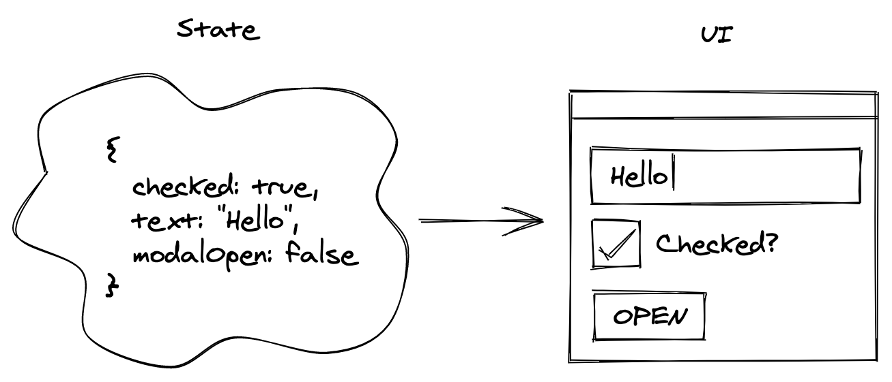

import { Figure } from '../../../src/components/CaptionedFigure'
import {
  FixedAspectRatioBox,
  CappedWidthBox,
} from '../../../src/components/FixedAspectRatioBox'
import { Counter } from './Counter'

<Figure>
  <CappedWidthBox maxWidth={300}>
    <FixedAspectRatioBox aspectRatio={2383 / 2500}>
      
    </FixedAspectRatioBox>
  </CappedWidthBox>
</Figure>

## Prereqs

In order to make the most out of this article, readers should have some familiarity with:

- Basic JavaScript syntax
- "Recent" JavaScript features like [destructuring assignments](https://developer.mozilla.org/en-US/docs/Web/JavaScript/Reference/Operators/Destructuring_assignment) and [spread syntax](https://developer.mozilla.org/en-US/docs/Web/JavaScript/Reference/Operators/Spread_syntax)
- DOM API's like `getElementById` and `addEventListener`

Prior experience with Redux is not required.

## Introduction

[Redux](https://github.com/reduxjs/redux) is a popular JavaScript library which is commonly paired together with UI frameworks (like React) in order to develop complex applications that are scalable and easy to maintain. In this article, I'll introduce the core concepts of Redux and then we'll build a minimal app with plain HTML/CSS/JS in order to illustrate those concepts in isolation. Future articles will explore Redux's integrations with UI frameworks like React.

## UI State

If you've heard of Redux before, you may have heard it described as a _state management_ library, so--before we go any further--let's zoom way out and chat about how we use the idea of _state_ in UI development.

In this context, _state_ is a set of data that describes how the UI should look. UI state can describe things like whether or not a checkbox is checked, the current text inside of a textbox, whether a modal is opened or closed etc.



The idea of stateful UI has been around for a very long time, but the way that we _manage_ state is still evolving and improving rapidly.

Let's take a look at how Redux approaches it.

## Redux

As a pure _state management_ library, Redux deals with the _data behind your UI_ rather than dealing with your UI itself. In fact, **Redux is entirely unopinionated about your UI** meaning that it can be used alongside _any_ UI solution (React, Svelte, Vue, or even plain old HTML/CSS/JS)! This is sometimes surprising to folks who have only seen Redux used alongside React, but we'll see in this post how Redux can work with any type of app at all.

Redux's super power is that it makes sure that every state-change in your application is predictable and traceable.

> If your app's state is starting to get unwieldy and you're having trouble figuring out \*how\* state-changes are propagating through your app, Redux may be able to help!

It is comprised of 4 basic components:

1. A **store** where your application's state is kept
2. **Actions** which are simple JavaScript objects that represent state-changing events in your app. Actions say to the store, "hey, Store, _something happened_ and you might need to update the current state!"
3. A **dispatcher** which is simply a mechanism used to submit those _actions_ to the _store_
4. And a **reducer** which is a function used by the store to determine _how_ your application's state should change in response to a given action

The terminology may be unfamiliar, but conceptually it's really pretty simple! We have a single place to keep our state (the store), we have a way to indicate to the store that _something happened_ (actions), and we have a way to interpret those actions in order to decide if/how the state should change (the reducer).

If you've used Redux with React before, you may be surprised that we haven't mentioned anything about `useMappedState`, `connect`, `<Provider>`, `mapStateToProps` etc. That's because those are concepts from the `react-redux` library which helps you integrate Redux with a React app. Redux works perfectly well on its own though--in fact--we're about to build a simple application with Redux and we're not going to use React at all!

## A Minimal Redux App

We're going to build a "counter" application. It'll have 2 buttons (plus and minus) and, between the buttons, it will display the current value of the counter. It'll look something like this:

<Counter />

### Disclaimer

The _state_ that this app tracks is just a single number (the current count), and there are only two ways that the state can change (the plus button and the minus button). **We don't need Redux in this app**!

> Remember: if you're having trouble figuring out \*how\* state-changes are flowing through your app, Redux can help by making sure that state-changes are predictable and traceable

Remember that adding a dependency or framework to your application almost always comes with a cost. In the case of Redux, we introduce some abstractions (e.g. actions, a store, a reducer) which are helpful in complex applications, but can add unnecessary cognitive load in simpler projects like this one.

With that said, let's use it anyway!

### The HTML

```html
<html>
  <head>
    <title>Redux Counter</title>
  </head>
  <body>
    <button id="subtractButton">-</button>
    <div id="counterDisplay">0</div>
    <button id="addButton">+</button>

    <script src="https://cdnjs.cloudflare.com/ajax/libs/redux/4.0.0/redux.js"></script>
    <script>
      // here is where we'll use Redux to manage our state
    </script>
  </body>
</html>
```

There it is. It's beautiful. It's 2 buttons and a div. We've included Redux via a script tag, but we haven't done anything with it yet. Let's change that!

### State

Before we get started, we need to think about the state that our app is going to track. Exactly _how_ you want to represent your state is up to you; as long as it contains enough info in order to produce your UI, it'll work. In this case, we really only need to know one thing in order to render our UI: the current value of the counter. So, let's keep our state in a simple object like this:

```ts
// this is not actually code
// it's just an illustration of what our state will look like
{
  count: number
}
```

More complex applications would have much more complicated state-layouts, but this one is perfect for our little counter.

Now that we know what our state is going to look like, let's think about the different ways that it can change!

### The Reducer (aka `getNextState`) Part 1

In the Redux world, the reducer function has a very important job: determine how the state should change after each _action_ occurs. That's why I sometimes think of the reducer as the `getNextState` function.

At a high level, you can think of the reducer like this:

```js
nextState = reduce(currentState, action)
```

We input the current state and some _action_ that just happened, and the reducer determines what data needs to change.

Before dive in to writing that function, let's take a detour to talk about _actions_.

### Actions

Actions represent the fact that _something just happened_ in the app. Every state-change in a Redux app can be traced back to a specific action.

Let's think about the different ways that our state can change in this app. Well, we know that the counter should increment when the user clicks the plus button, and it should decrement when the user clicks the minus button. Pretty straight-forward!

Okay, now let's use what we know about the reducer in order to figure out what our actions should look like. We don't know _exactly_ how the reducer is going to work yet, but we know the inputs and outputs that we want, right?

The inputs are `currentState` and an `action`, and the output is `nextState`. So let's sketch out a few examples.

Let's say that we're starting fresh and the currentState is `{ count: 0 }`, and then the user clicks the plus button. Now, we know that the output (nextState) should be `{ count: 1 }`, so if we substitue those values into our reducer equation we get:

```js
nextState = reduce(currentState, action)
// algebra!
{ count: 1 } = reduce({ count: 0 }, action)
```

Again, we haven't written the `reduce` function yet, but we know that whatever we pass in for `action` needs to be able to tell `reduce` to increment the count by 1.

So, how about `action = 'ADD'`?

That'll work! When we're writing the reducer function, we'll just say:

```js
function reduce(currentState, action) {
  if (action === 'ADD') {
    // increment the count
  }
}
```

Let's put this into some real code:

```js
const ADD_ACTION = 'ADD'
const SUBTRACT_ACTION = 'SUBTRACT'
```

In theory, these simple actions would work fine. But, since applications are often much more complex than this one, Redux actually insists that your actions are represented as objects with a `type` property.

```js
const ADD_ACTION = { type: 'ADD' }
const SUBTRACT_ACTION = { type: 'SUBTRACT' }
```

This may seem like an odd constraint, but it's probably the right thing to do in most cases anyway. As an exercise, let's imagine that we didn't have that contraint and see what happens as the app gets more complex.

#### Adding Complexity

Let's say that somewhere down the line we want to add another button to our app that added 10 to our counter rather than just adding 1. How would we represent that functionality as an action?

Well, (assuming that we didn't have the `{ type }` constraint) we could define another action `ADD_10_ACTION = 'ADD_10'` and then in our reducer we'd say:

```js
function reduce(currentState, action) {
  if (action === 'ADD') {
    // increment counter by 1
  } else if (action === 'ADD_10') {
    // increment counter by 10
  }
}
```

That would work, but now we need to duplicate the code for incrementing. If we add a +5 button or a +20 button, we'd duplicate that code again and again. Instead, let's leverage the fact that (in this thought experiment) actions can be whatever we want.

Rather than passing a string like `"ADD"` or `"ADD_10"`, let's pass an object that indicates both the fact that we want to _add_ **and** the amount that we want to add.

```ts
// this is not actually code
// it's just an illustration of what our actions could look like
ADD_N_ACTION: { type: 'ADD', amount: number }
```

Now our reducer can be much simpler:

```js
function reduce(currentState, action) {
  if (action.type === 'ADD') {
    // increment counter by action.amount
  } else if (action.type === 'SUBTRACT') {
    // decrement the counter by action.amount
  }
}
```

Much better! Now we can have as many add-buttons in our app as we want and we don't have to duplicate any code.

And if we stick with the convention of having our actions always have a `type` property, we can write our reducer with a `switch` statement rather than a bunch of `if`/`else` blocks.

```js
function reduce(currentState, action) {
  switch (action.type) {
    case 'ADD':
    // increment the counter by action.amount
    case 'SUBTRACT':
    // decrement the counter by action.amount
    default:
    // don't change anything
  }
}
```

So, that's my attempt at convincing you that even though using objects with `type` properties may seem like an odd contraint, it's probably the right thing to do anyway.

Before we jump back to our simple version of the app, I'd like to make one more optimization to the complex version in order to illustrate a common pattern seen in Redux apps: Action Creators.

#### Action Creators

Now that we're using

```js
const ADD_1_ACTION = { type: 'ADD', amount: 1 }
const ADD_5_ACTION = { type: 'ADD', amount: 5 }
const ADD_10_ACTION = { type: 'ADD', amount: 10 }
const SUBTRACT_1_ACTION = { type: 'SUBTRACT', amount: 1 }
```

Hm. That's a lot of duplicated boilerplate. What if we wrote some little helper functions to generate those actions for us?

```js
function createAddAction(amount) {
  return { type: 'ADD', amount: amount }
}

function createSubtractAction(amount) {
  return { type: 'SUBTRACT', amount: amount }
}
```

Beautiful! Now we can handle adding or subtracting _any_ amount without needing to manually add more actions or needing to update our reducer.

This pattern of creating helper-functions which generate actions is called the _Action Creator_ pattern, and it's so helpful that it's often taught as the primary way to handle actions with Redux! But I want you to keep in mind there's nothing Redux-specific about the code that we just added; indeed, we haven't even used the Redux library yet! We used our JavaScript skills to come up with a more scalable pattern that uses objects rather than strings and to build helper functions that make our lives easier.

This is going to be a theme throughout the blog post: most of the perceived "magic" around Redux is actually just handy patterns like this one that folks have devised in order to make their lives easier.

Alright, now let's head back to the simple version of the app.

### The Reducer (aka `getNextState`) Part 2

Now that we know all about actions, we can write our reducer function for real.

Remember, the reducer is a function which is supplied with the current state of the app and an _action_ (like the ones we just described) and it must return the _next_ state of the app.

```html
<script>
  // action creators omitted for brevity

  const initialState = { count: 0 }

  /*
  when our reducer runs for the very first time,
  `currentState` will be undefined.
  in that scenario, we'll use a pre-determined `initialState`
  */
  function reduce(currentState = initialState, action) {
    switch (action.type) {
      case 'ADD':
        return {
          count: currentState.count + action.amount,
        }
      case 'SUBTRACT':
        return {
          count: currentState.count - action.amount,
        }
      default:
        /*
        if the action.type was not ADD or SUBTRACT,
        we return the currentState unchanged
        */
        return currentState
    }
  }
</script>
```

This should be pretty straight-forward, but there are a few parts that might not be intuitive yet. Let's break it down.

#### Initial State

The trick here is that when Redux first initializes, it is going to call our reducer function with `undefined` as the `currentState` and a special "init" action (e.g. `{ type: '__REDUX_INIT__' }`) in order to figure out the first state of the app. Since `currentState` is `undefined`, our reducer function will use `initialState` as the value for `currentState`. Next, the reducer will run through our switch statement to see how to handle the special "init" action from Redux. Since our switch statement doesn't describe any way of handling the special "init" action, we'll fall through to the default case and return the `initialState`.

This is kind of a convoluted little dance to get the initial state, but it's important so that our app starts off with the proper initial values.

#### How Redux Detects a Change

The next part that might look a little funny is the return statement.

```js
return {
  count: currentState.count + action.amount,
}
```

Here, we're creating a new object with the updated `count` value and returning it. But wouldn't it have been simpler to do something like this:

```js
// this reducer is broken!
// read on to see why

function reduce(currentState, action) {
  switch (action.type) {
    case 'ADD':
      currentState.count += action.amount
    case 'SUBTRACT':
      currentState.count -= action.amount
    default:
    // don't change anything
  }

  return currentState
}
```

This reducer is much simpler, but it actually won't work! Indeed it takes the `currentState` and an `action` and returns the `nextState`, but Redux actually requires an extra hint from us in order to determine if the state actually changed or not. That hint is when we _return a new object_ rather than returning the same state-object that was passed in.

So, this works great:

```js
return { count: currentState.count + action.amount }
```

And this doesn't work at all:

```js
currentState.count++
return currentState
```

> Understanding this behavior is _crucial_ for anyone using Redux; it's a little bit tricky at first, but it's also what allows Redux to be so incredibly fast.

In order to grasp what's going on, we need to think about how Redux actually detects a change in our app's state. It works like this:

1. Redux takes note of the `currentState`
2. Redux calls our reducer function in order to determine the `nextState`
3. Redux compares the old `currentState` with the new `nextState` and decides if something has changed

Step 3 is where we'll focus.

Redux technically has a few options for how it could compare the old state to the new state, but keep in mind that `nextState` and `currentState` might be huge, complex objects which represent the entire state of a highly-interactive app. If Redux took the time to traverse the entire `currentState` and `nextState` objects in order to determine if _every single key_ and _every single value_ is exactly the same between both of them, it would take much too long in complicated apps. Instead, it uses a _referential comparison_ (e.g. `nextState !== currentState`) to see if the two values _refer_ to the same object or to different ones.

This referential comparison is **super fast**, and it stays super fast even as your app gets more and more complex. Conversely, if Redux took the time to compare every single value in your state, it would get slower and slower as your app grew.

So, now that we know that Redux uses a `referential comparison` in order to detect changes. It's clear why we always return a new object when the state changes, and we return the old object when the state didn't change.

Here's an annotated version of our reducer:

```js
switch (action.type) {
  case 'ADD':
    // returns a new object
    return {
      count: currentState.count + action.amount, // overwrite count
    }
  case 'SUBTRACT':
    // returns a new object
    return {
      count: currentState.count - action.amount, // overwrite count
    }
  default:
    // return the old currentState as-is, there's no change
    return currentState
}
```

The takeaway:

> Always return a new object from your reducer in order to hint to Redux that the state has changed

#### Future Proofing

Before we move on, we're going to make one more change to our reducer so that we're ready to handle new features in the future.

Let's say that as time goes on we decide to add a new feature to our counter that lets users change the theme color from light-mode to dark-mode.

Now we've got some more state to track. Rather than just `{ count: number }` we have `{ count: number, theme: 'dark' | 'light' }`. How would our reducer change in that scenario?

```js
// add an initial value
const initialState = { count: 0, theme: 'light' }

function reduce(currentState = initialState, action) {
  switch (action.type) {
    case 'ADD':
      return {
        // keep the current theme the same
        theme: currentState.theme,
        // update the count
        count: currentState.count + action.amount,
      }
    case 'SUBTRACT':
      return {
        // keep the current theme the same
        theme: currentState.theme,
        // update the count
        count: currentState.count - action.amount,
      }
    case 'CHANGE_THEME':
      return {
        // keep the current count the same
        count: currentState.count,
        // update the theme
        theme: action.newTheme,
      }
    default:
      return currentState
  }
}
```

Not so bad. But notice that we had to add an extra line to each of the different `case`s. When we update the count, we need to make sure that we copy over the current theme unchanged. Likewise, when we update the theme, we need to make sure that we copy over the current count unchanged. That's because Redux expects us to return the _entire_ `nextState`, not just a little piece of it.

Okay, but what about when the app gets even more complex and we need to keep track of even more state? Are we going to need to add an extra line to every `case` in our reducer in order to copy over the new state? That would be a pain.

Instead, let's make use of our JavaScript skills and copy _all of the values_ from the `currentState` into the `nextState` and then just overwrite the parts that we want to change. Here's what that might look like:

```js
const initialState = { count: 0, theme: 'light' }

function reduce(currentState = initialState, action) {
  switch (action.type) {
    case 'ADD':
      return {
        // copy *all* values from currentState
        ...currentState,
        // overwrite the count with the new value
        count: currentState.count + action.amount,
      }
    case 'SUBTRACT':
      return {
        // copy *all* values from currentState
        ...currentState,
        // overwrite the count with the new value
        count: currentState.count - action.amount,
      }
    case 'CHANGE_THEME':
      return {
        // copy *all* values from currentState
        ...currentState,
        // overwrite the theme with the new value
        theme: action.newTheme,
      }
    default:
      return currentState
  }
}
```

Now we're cooking! Next time we want to add some more state, all of our previous `case`s will automatically handle copying the value so that we don't have to painstakingly add code to each one.

This is another super common pattern that you'll see in almost every Redux app and Redux tutorial. It's another example of a pattern that's not strictly necessary, but is so common that it seems like a rule enforced by Redux.

Next, we'll use the Redux library in order to create a store where we can keep our state.

### Store

Redux's `createStore` function will create a store and connect it to our reducer. Note that this is the first time we've actually used the Redux library at all; everything else that we've done has just been plain old objects and functions!

```html
<script>
  // ... actions and reducer omitted for brevity

  const store = Redux.createStore(reduce)
</script>
```

Now, whenever the store receives an action, it will use our reducer function in order to figure out the next state and it will update itself.

So how do we send actions to the store?

### Dispatch

Telling the store when an action happens is as simple as invoking `store.dispatch()` with your action.

```html
<script>
  // ... actions and reducer omitted for brevity

  const store = Redux.createStore(reduce)

  addButtonElement.addEventListener('click', () => {
    // we'll create an ADD_1 action using our actionCreator
    // createAddAction(1) returns { type: "ADD", amount: 1 }
    const ADD_1_ACTION = createAddAction(1)

    // then dispatch it to the store
    store.dispatch(ADD_1_ACTION)
  })

  subtractButtonElement.addEventListener('click', () => {
    const SUBTRACT_1_ACTION = createSubtractAction(1)
    store.dispatch(SUBTRACT_1_ACTION)
  })
</script>
```

Brilliant! Now whenever the add-button and subtract-button elements are clicked, an appropriate action will be dispatched to the store. We're nearly finished!

Let's take a moment to recap what we've done so far.

- We defined the shape of the _state_ of our app: it looked like this `{ count: number }`
- We defined 2 _action-creators_, which create actions for us. The actions themselves were just simple objects like this `{ type: "ADD", amount: 1 }`
- We defined our _reducer_, which is a function that handles the operation: `currentState + action = nextState`
- We used `Redux` to create a store and told that store that it should use our reducer function to figure out _how_ to change its stored state
- We defined click-handlers for our buttons which use the store's `dispatch` function to send `ADD_ACTION`s and `SUBTRACT_ACTION`s to the store

All that's left to do is to watch the store to see when its stored state changes and then to update the UI with the new counter value!

### Subscribing to changes

We'll use the `subscribe` function that's exposed by the `store` in order to listen for any changes to our app's state.

```html
<script>
  // ... actions, reducer, store-creation, and action-dispatching omitted for brevity

  // a simple "renderer" that takes our state and updates the UI
  function render(state) {
    counterElement.innerText = state.count
  }

  store.subscribe(() => {
    // get the state
    const stateSnapshot = store.getState()

    render(stateSnapshot)
  })
</script>
```

And we're done! Every time the store's state changes, we'll be notified and we'll run our little `render` function in order to update the UI. You can check out the full annotated code in action in [this CodeSandbox](https://codesandbox.io/s/redux-minus-react-edmfu).

## Wrap Up

We've just written a minimal, but fully-functional Redux application. We've seen how "actions" are just simple objects, the reducer is just a plain function, and that the Redux-specific code really just boils down to:

1. `createStore` - to create the store
2. `store.dispatch` - to dispatch an action
3. `store.subscribe` - to listen for updates to the state

Now that we've covered the core functionality of Redux, we can look at [how it integrates with a framework like React](/react-redux).
