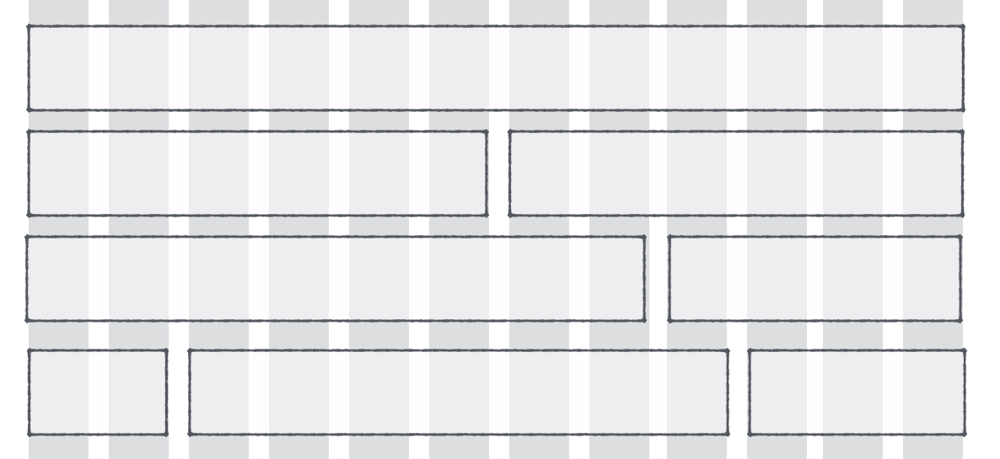

import { Image } from '../../../src/components/Image'
import { Caption, Figure } from '../../../src/components/CaptionedFigure'

## Responsive Web Design

In today's world, we know that folks are just as likely to visit our web page on their phone as they are to visit our web page on a laptop/desktop computer. So, in order to make sure that folks get a great experience no matter how they choose to interact with our content, we need to be thinking about how our page _responds_ to different screen-size requirements. A page is considered to be _responsive_ when it is able to alter its layout in order to fit _any_ user's screen.

<Figure>
  
  <Caption>
    Source:{' '}
    <a href="http://blog.usabilla.com/wp-content/uploads/mobile-first.png">
      Usabilla - Mobile First Web Development
    </a>
  </Caption>
</Figure>

Building responsive pages isn't always easy, but some helpful patterns have emerged that make the job a little bit easier. I'm going to talk a little bit about these patterns and then introduce a new pattern that I've been using that I really like.

### Relative Units

One of the fundamental steps for embracing responsive design is to shift from thinking in terms of exact pixel-sizes to thinking in terms of _relative_ sizes. In responsive pages, we can use relative units to specify that a component should take up, for example, 30% of the screen's width rather than specifying that the component should take up some exact number of pixels. This ensures that our components grow and shrink based on the size of the user's screen.

<Figure>
  <video autoPlay loop style={{ width: '100%' }}>
    <source type="video/webm" src="./relative-units.webm" />
    <source type="video/mp4" src="./relative-units.mp4" />
  </video>
  <Caption>
    Source:{' '}
    <a href="https://www.fastcompany.com/3038367/9-gifs-that-explain-responsive-design-brilliantly-2">
      Fast Company - 9 Gifs the Explain Responsive Design Brilliantly
    </a>
  </Caption>
</Figure>

### Grid Systems

Utilizing a _grid system_ builds on the concept of relative units and provides a bit more structure, as well as some other useful functionality. With a grid system, we typically split the screen into 12 columns and we say that a component should take up, for example, 4 out of 12 columns. This limits our choices for how wide a component can be (e.g. we can't specify that something should take up exactly 23% of the screen; we'd have to choose either 2/12 columns or 3/12 columns), but having fewer choices often makes designing pages easier and it results in more uniform-looking pages.

<Figure>
  
  <Caption>
    Source:{' '}
    <a href="https://zellwk.com/blog/designing-grids/">
      Zellwk.com - Designing Grids
    </a>
  </Caption>
</Figure>

Grid systems also enable us to speficy a certain screen size where our components should _wrap_ down to the next row rather than shrinking to an unusable size. On larger devices it might make sense for two components to be side-by-side, each taking up 6 out of 12 columns. But on a mobile phone, we might prefer those two components to be stacked one on top of the other rather than side-by-side. This type of behavior relatively straightforward with a grid-based approach.

The grid system pattern is all about the structure of your page. It's like the

### Breakpoints

Well, the first step is to decide exactly what we mean by "large", "medium", and "small". We need to decide the exact window-widths where we switch from one to the next. Commonly, these specific widths are called _breakpoints_ and the ranges themselves ("large", "medium", "small") are called _screen classes_.

You probably knew that. In fact, your website/app probably already has a set of breakpoints and screen classes defined in its CSS. In the world of modern web development, we strive to make our websites _responsive_ so that they look good on any screen size, and defining your screen classes in CSS is often the first step toward making a responsive website.
